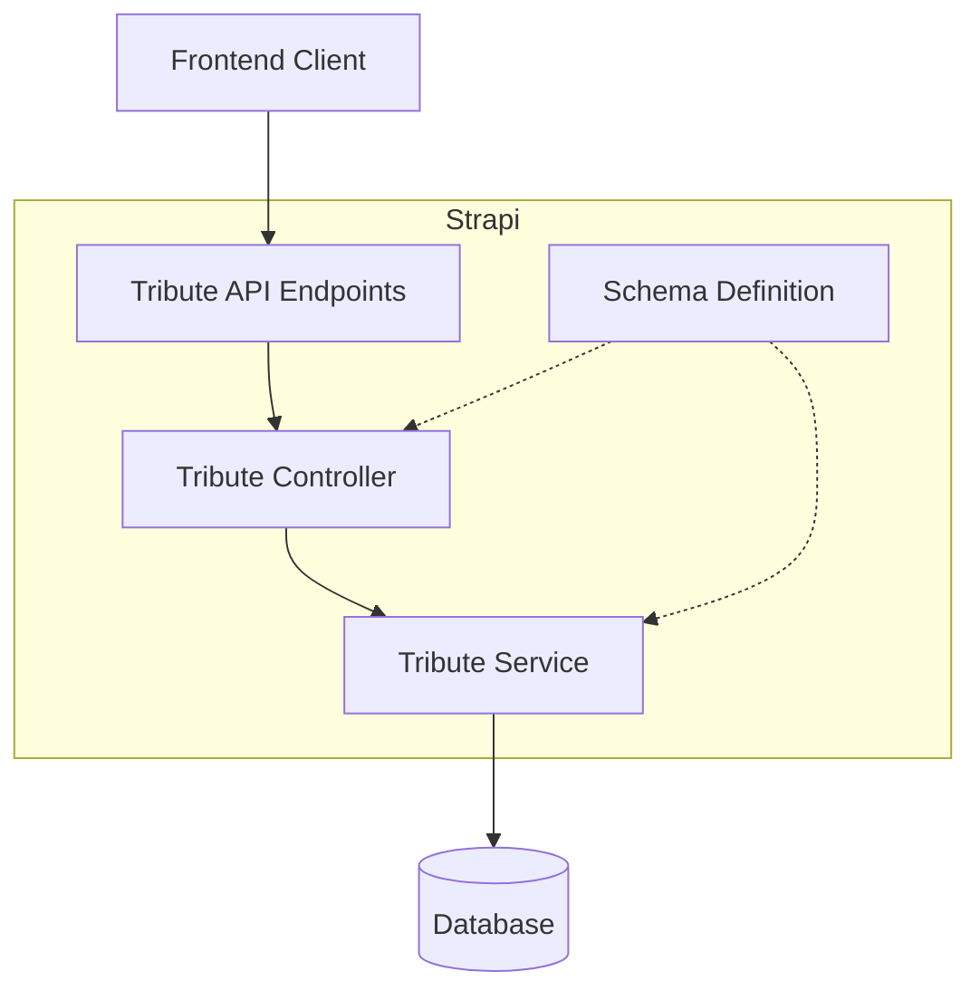
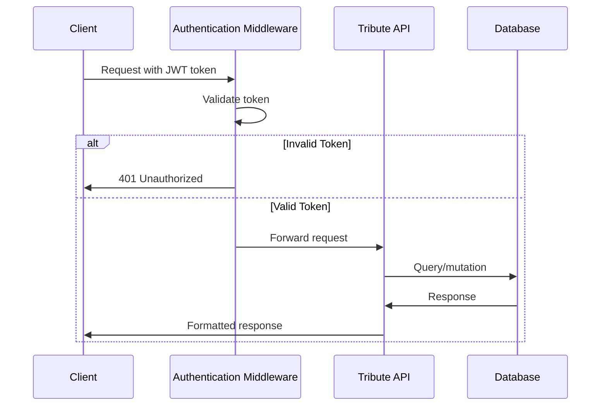
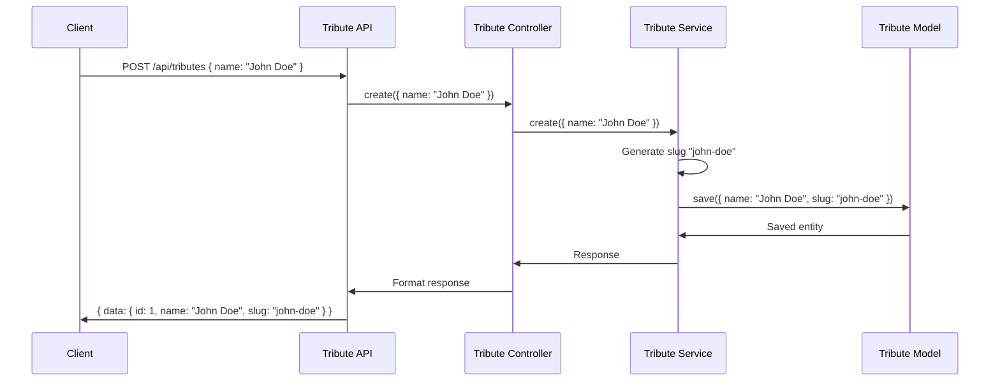

# Tribute Collection Type Implementation Diagram

## Directory Structure

```
backend/database/src/api/
└── tribute/                              # API folder for Tribute collection
    ├── content-types/                    # Content type definitions
    │   └── tribute/                      # Tribute content type
    │       └── schema.json               # Schema definition with fields and validations
    ├── controllers/                      # Request handlers
    │   └── tribute.ts                    # Controller logic (uses default implementation)
    ├── routes/                           # API route definitions
    │   └── tribute.ts                    # Route configuration (uses default routes)
    └── services/                         # Business logic
        └── tribute.ts                    # Service methods (uses default implementation)
```

## Component Relationships



## Authentication Flow



## Data Flow: Creating a Tribute



## Implementation Steps

1. Create directory structure
2. Add schema.json with field definitions
3. Add controller, routes and service files
4. Restart Strapi
5. Configure permissions in admin UI
6. Test API endpoints

## API Endpoints (Auto-generated)

- **GET /api/tributes**: List all tributes
- **GET /api/tributes/:id**: Get a specific tribute
- **POST /api/tributes**: Create a new tribute
- **PUT /api/tributes/:id**: Update a tribute
- **DELETE /api/tributes/:id**: Delete a tribute

## Key Security Considerations

- Authentication handled via Strapi's permission system
- Field validations ensure data integrity
- Slug uniqueness enforced at database level
- Draft/publish workflow for content moderation