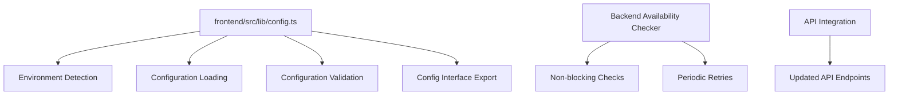

# TributeStream Centralized Configuration System Plan

## Overview

This document outlines the design and implementation plan for a centralized configuration system for the TributeStream application. The goal is to eliminate hardcoded configuration values, support multiple environments, and implement connection verification with the backend.

## 1. Configuration Structure



## 2. Core Components

### 2.1 Configuration File

**Path:** `frontend/src/lib/config.ts`

The central configuration file will:
- Define typed interfaces for all configuration options
- Detect the current environment
- Load environment-specific configurations
- Use environment variables with fallbacks to defaults
- Validate the configuration
- Export a unified config object

### 2.2 Configuration Interface

```typescript
export interface AppConfig {
  // Environment
  environment: 'development' | 'staging' | 'production';
  
  // API settings
  api: {
    baseUrl: string;       // Base URL for frontend API endpoints
    strapiUrl: string;     // URL for Strapi backend
    port: number;          // Port for Strapi backend
    timeout: number;       // API request timeout in milliseconds
    retryInterval: number; // Interval for retry attempts in milliseconds
    maxRetries: number;    // Maximum number of retry attempts
  };
  
  // Auth settings
  auth: {
    tokenName: string;     // Name of the cookie storing the JWT
    tokenExpiry: number;   // Token expiry time in seconds
  };
  
  // Feature flags
  features: {
    enableBackendCheck: boolean; // Whether to enable backend availability checking
    // Add other feature flags as needed
  };
}
```

### 2.3 Environment-Specific Configurations

Default configurations for each environment:

**Development:**
- API base URL: `/api`
- Strapi URL: `http://localhost:1338`
- Timeouts: Longer for debugging
- Debug features enabled

**Staging:**
- API base URL: `/api`
- Strapi URL: From environment variable or fallback
- Moderate timeouts
- Some debug features enabled

**Production:**
- API base URL: `/api`
- Strapi URL: Required from environment variable
- Short timeouts
- Debug features disabled

### 2.4 Backend Availability Checker

**Path:** `frontend/src/lib/backendChecker.ts`

Will implement:
- Non-blocking connection verification
- User-friendly error display
- Periodic retry mechanism
- Svelte store for status tracking

## 3. Implementation Plan

### 3.1 Create Configuration Files

1. Create `frontend/src/lib/config.ts`
   - Define configuration interfaces
   - Implement environment detection
   - Load environment-specific configurations
   - Validate configuration
   - Export config object

2. Create `frontend/src/lib/backendChecker.ts`
   - Implement backend availability checking
   - Create Svelte store for status
   - Add retry logic

### 3.2 Update Existing API Endpoints

Update the following files to use the centralized configuration:
- `frontend/src/routes/api/tributes/+server.ts`
- `frontend/src/routes/api/tributes/[tributeId]/+server.ts`
- `frontend/scripts/check-backend.js`

### 3.3 Integrate Backend Checker

1. Add initialization in a root layout or hooks
2. Add error display component
3. Integrate with existing error handling

## 4. Configuration Options

### 4.1 API Configuration

| Option | Description | Default (Dev) | Env Variable |
|--------|-------------|--------------|--------------|
| `api.baseUrl` | Base URL for API endpoints | `/api` | `PUBLIC_API_BASE_URL` |
| `api.strapiUrl` | URL for Strapi backend | `http://localhost:1338` | `PUBLIC_STRAPI_URL` |
| `api.port` | Port for Strapi backend | `1338` | `PUBLIC_STRAPI_PORT` |
| `api.timeout` | Request timeout (ms) | `10000` | `PUBLIC_API_TIMEOUT` |
| `api.retryInterval` | Retry interval (ms) | `10000` | `PUBLIC_RETRY_INTERVAL` |
| `api.maxRetries` | Maximum retries | `3` | `PUBLIC_MAX_RETRIES` |

### 4.2 Authentication Configuration

| Option | Description | Default (Dev) | Env Variable |
|--------|-------------|--------------|--------------|
| `auth.tokenName` | Cookie name for JWT | `jwt` | `PUBLIC_AUTH_TOKEN_NAME` |
| `auth.tokenExpiry` | Token expiry (seconds) | `86400` (1 day) | `PUBLIC_AUTH_TOKEN_EXPIRY` |

### 4.3 Feature Flags

| Option | Description | Default (Dev) | Env Variable |
|--------|-------------|--------------|--------------|
| `features.enableBackendCheck` | Enable backend checking | `true` | `PUBLIC_ENABLE_BACKEND_CHECK` |

## 5. Benefits

1. **Maintainability**: Single source of truth for configuration
2. **Environment Support**: Easy switching between environments
3. **Error Prevention**: Type safety and validation
4. **Performance**: Optimized backend checking
5. **User Experience**: Friendly error messages